

  <b><h1>Find pets para mobile</h1></b>
  
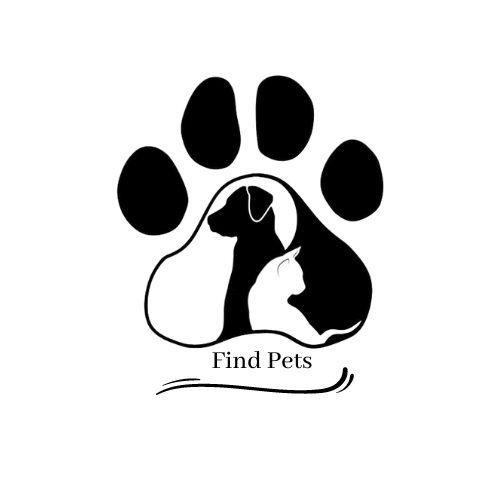

##

  <b><h1>💡 Sobre</h1></b>

Diversos animais são abandonados ou perdidos todos os dias e não existe nenhuma ferramenta para a adoção dos mesmos. Nesse projeto vamos dar mais uma chance para todos os animais que estejam precisando de um novo lar com um aplicativo onde possa ser adotado o animal e assim facilitar a adoção de animais.

##

  <b><h1>📊 Status do projeto</h1></b>

  <b>🏆 Finalizado 🏆</b>

##

  <b><h1>🎯 Tarefas</h1></b>

Clique para visualizar as tarefas feitas

|      Estado      |     Plataforma   |                 Tarefa                |
|      :---:       |       :---:      |                  :---:                |
|:heavy_check_mark:|:computer:        |Cadastro de animais  |
|:heavy_check_mark:|:computer:        |Cadastro de usuários  |
|:heavy_check_mark:|:computer:        |Tela de anúncios  |
|:heavy_check_mark:|:computer:        |Chat de conversas |

##

  <b><h1>Resultados</h1></b>

  
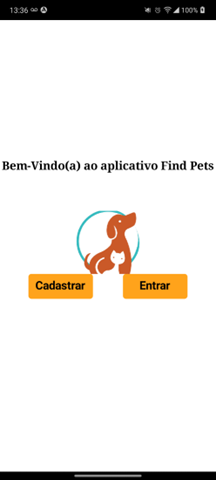
# Tela de carregamento
  
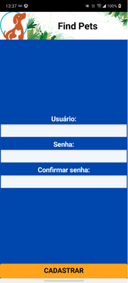
# Tela de cadastro

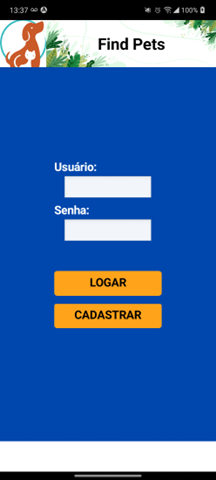
# Tela de login

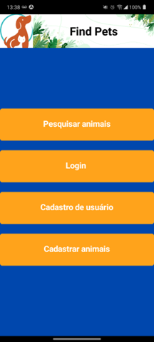
# Tela de menu

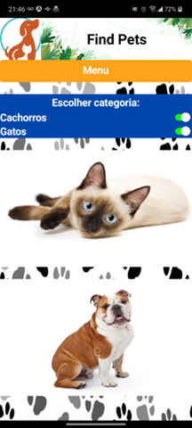
# Tela de pesquisa de animais

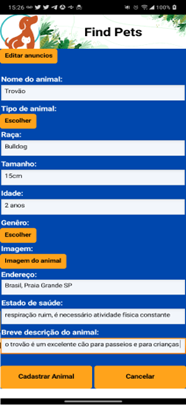
# Tela de cadastro de animais 1

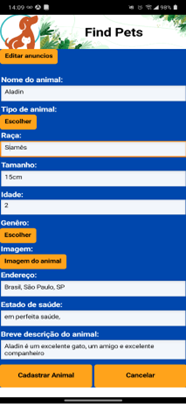
# Tela de cadastro de animais 2

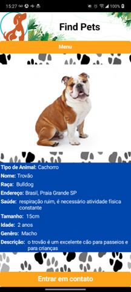
# Tela de anúncio 1

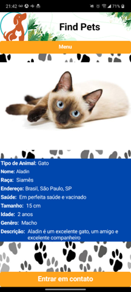
# Tela de anúncio 2

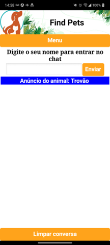
# Tela de chat 1

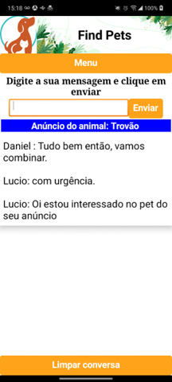
# Tela de chat 2

##

  <b><h1>💻 Download</h1></b>

Para fazer uso desse repositório e dos códigos, você pode cloná-lo em seu GitHub com a opção de fork ou clique em [`baixar`](https://github.com/RamonCintas/Find-Pets-Mobile/archive/refs/heads/main.zip) esse repositório.

##

  <b><h1>⚔️ Tecnologias</h1></b>

As seguintes ferramentas foram utilizadas para desenvolver esse repositório:

|Ferramentas|
|:-:|
|[Sistema Windows](https://www.microsoft.com/pt-br/windows)|
|[MIT App Inventor](https://appinventor.mit.edu/)|

##

  <b><h1> 👨‍💻 Autor</h1></b>

<a href="https://github.com/RamonCintas">
 
  
 <b>Ramon Cintas</b>
</a>

Desenvolvido por Ramon Cintas entre em contato!

  
 
 

##

  <b><h1>⚖️ Licença</h1></b>

Copyright © [Ramon Cintas](https://github.com/RamonCintas). 
Este projeto é licenciado por [MIT](./LICENSE).

